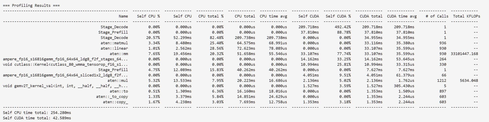
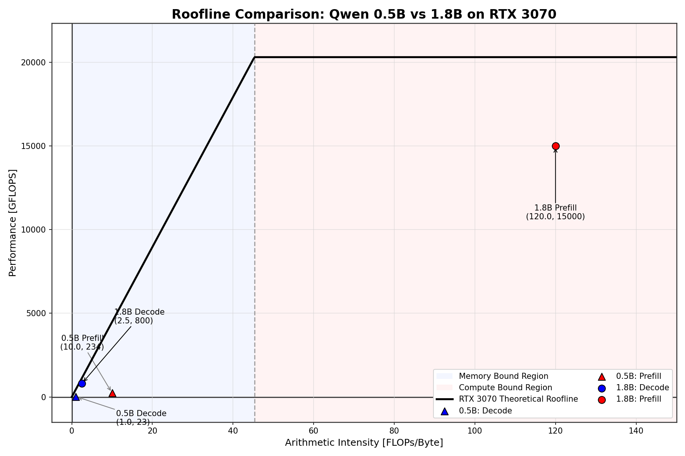
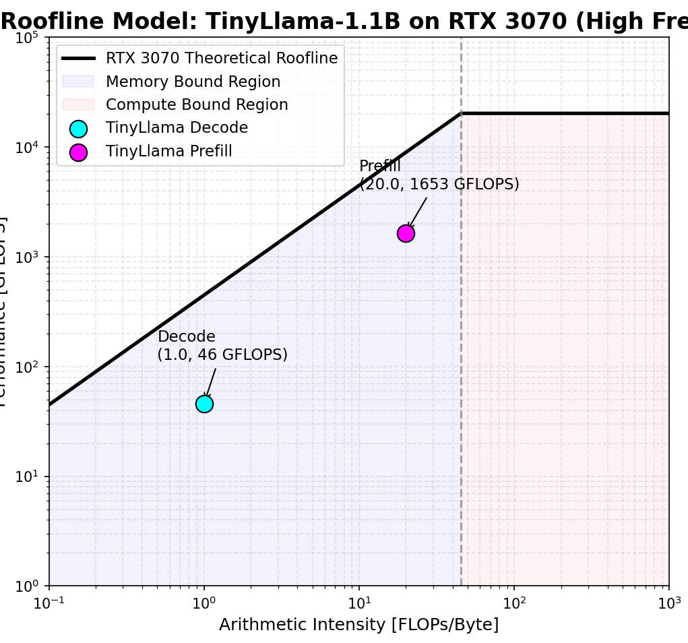
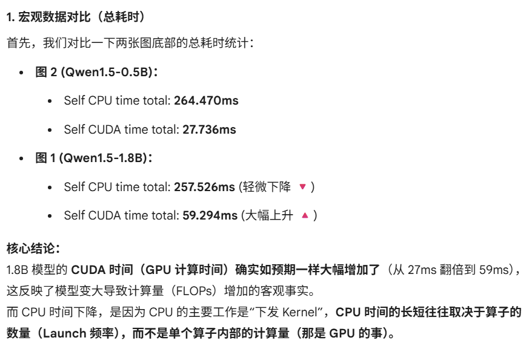
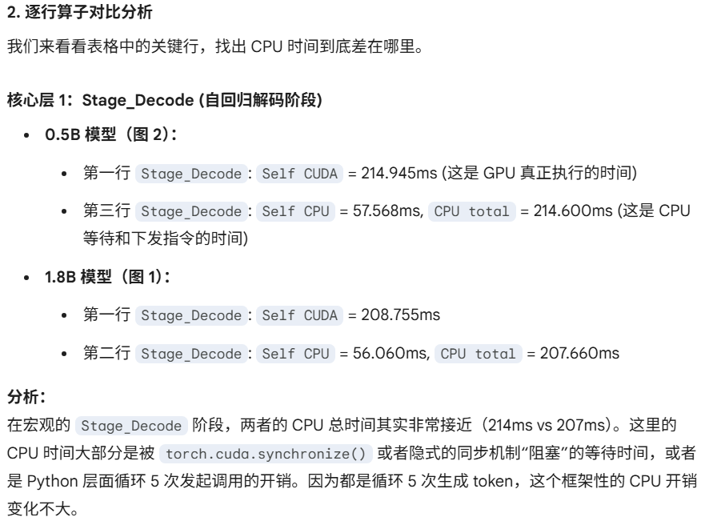
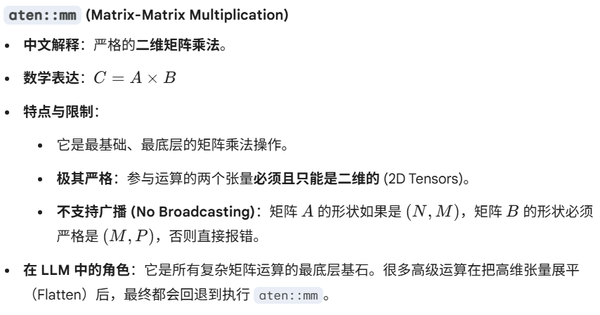
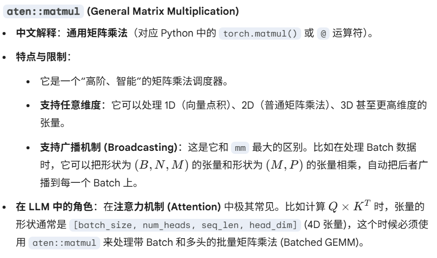
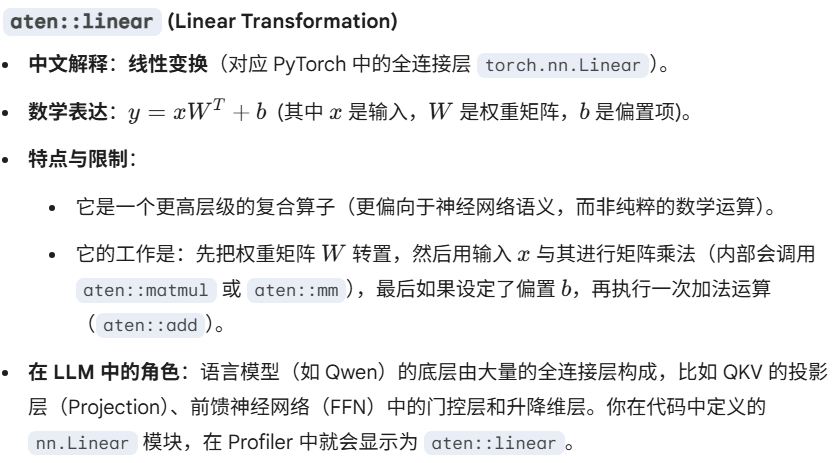
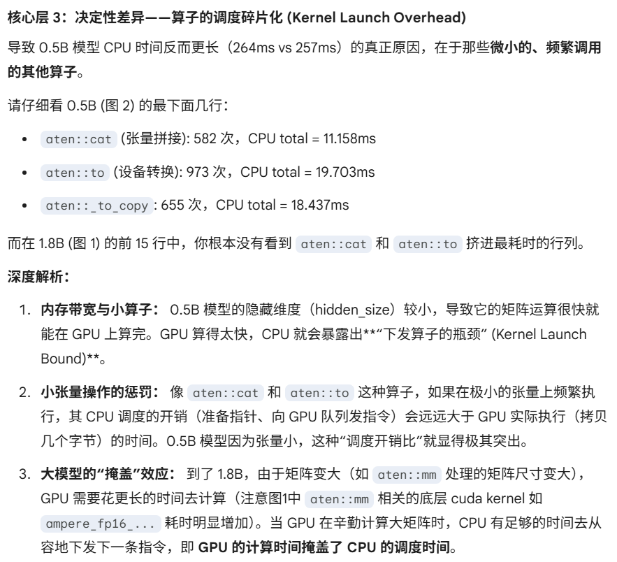

1、通过VS登录到服务器

登录时遇到报错，注意事项：
①退出梯子才能登atrust，这时候小狐狸比快连好用


②退出梯子后显示


解决方案：按 Win + R 打开运行窗口，输入 ncpa.cpl 并回车，打开“网络连接”面板。在里面找到atrust创建的虚拟网卡，右键属性，在中间的“此连接使用下列项目”列表中，你会看到很多打勾的选项。
保留：
Internet 协议版本 4 (TCP/IPv4)
Internet 协议版本 6 (TCP/IPv6)
Microsoft 网络客户端
Microsoft 网络的文件和打印机共享
取消勾选：
Microsoft LLDP 协议驱动程序
链路层拓扑发现响应程序
链路层拓扑发现映射器 I/O 驱动程序
然后点击确定，再退出火绒，就可以登陆服务器了

2、检查环境

查看项目文件夹内容
ls -lh ~/llama-project
查看有哪些Python环境可以用
source ~/miniconda3/bin/activate && conda env list
查看8张显卡的状态
nvidia-smi
输出


3、建立新的Python环境

（1）安装所需环境
conda create -n llmtest1 python=3.10 -y
conda activate llm_roofline
安装pytorch和transformer
pip install torch torchvision torchaudio --index-url https://download.pytorch.org/whl/cu121
pip install transformers accelerate nvitop
下载模型时报错OSError: Can't load the configuration
原因：服务器连不上 Hugging Face 的官方网站，模型权重下载失败了。 由于国内的网络环境，直接从服务器连接 Hugging Face 通常会超时或被阻断。我们之前预料到了这种情况，现在立刻换用国内的镜像源来解决。
声明镜像地址
export HF_ENDPOINT=https://hf-mirror.com
重新运行脚本
python profile_llm.py

4、写程序

编写了个ncn探针程序，但是没有root就没有安装ncn的权限，换用pytorch自带的torch.profiler
用 nano profile_llm.py 打开你的脚本，并写入代码：
```
import torch
from transformers import AutoModelForCausalLM, AutoTokenizer
from torch.profiler import profile, record_function, ProfilerActivity

model_id = "Qwen/Qwen1.5-0.5B"
print(f"Loading {model_id}...")
tokenizer = AutoTokenizer.from_pretrained(model_id, trust_remote_code=True)
# 明确指定放在第 0 张卡上
model = AutoModelForCausalLM.from_pretrained(model_id, device_map="cuda:0", trust_remote_code=True, torch_dtype=torch.float16)

prompt = "Explain the roofline model in computer architecture:"
inputs = tokenizer(prompt, return_tensors="pt").to(model.device)

print("Warming up GPU...")
# 先空跑一次预热 GPU，让显存分配完毕，测出来的时间才准
with torch.no_grad():
    model(**inputs)

print("Starting PyTorch Profiler...")
# 启动 PyTorch 探针！开启 flops 计算和 shape 记录
with profile(
    activities=[ProfilerActivity.CPU, ProfilerActivity.CUDA],
    record_shapes=True,
    with_flops=True  # 核心参数：让 PyTorch 帮我们算 FLOPs
) as prof:

    # --- 1. 抓取 Prefill 阶段 ---
    with record_function("Stage_Prefill"):
        with torch.no_grad():
            outputs = model(**inputs)

    past_key_values = outputs.past_key_values
    next_token = torch.argmax(outputs.logits[0, -1, :]).unsqueeze(0).unsqueeze(0)

    # --- 2. 抓取 Decode 阶段 ---
    with record_function("Stage_Decode"):
        with torch.no_grad():
            # 生成 5 个 Token 测一下平均水平
            for _ in range(5):
                out = model(input_ids=next_token, past_key_values=past_key_values, use_cache=True)
                past_key_values = out.past_key_values
                next_token = torch.argmax(out.logits[0, -1, :]).unsqueeze(0).unsqueeze(0)

# 打印出最耗时的前 15 个算子
print("\n=== Profiling Results ===")
print(prof.key_averages().table(sort_by="cuda_time_total", row_limit=15))

# 导出一个可视化的 json 文件，我们可以拖到浏览器里看时间线
prof.export_chrome_trace("llm_trace.json")
print("\nTrace saved to llm_trace.json")
```
按ctrl+O在nano中保存，然后按Ctrl+x退出
退出之后
python profile_llm.py
运行程序
小tips：如果原文件修改的的多，直接rm 文件名删除，然后再nano一个文件，再写入会更快
运行之后输出

5、实验结果




实验结果分析：


6、roofline图像




为什么画出的图像图线不是从原点开始的？


结论： 随着输入序列长度L或 Batch Size 的增加，算术强度 I 会直线上升（比如从刚才测试的 $I=10$ 飙升到上百）。点位在 Roofline 图上疯狂向右移动，跨过拐点，最终卡车运砖的速度不再是瓶颈，而是工人们的手速达到了极限——这就是算力天花板。

7、对照实验分析

（1）为什么参数量增大之后速度反而快了
代码里的模型从 Qwen-0.5B 换成了 TinyLlama-1.1B。
这组数据反而揭示了一个极其反直觉、但也极具学术讨论价值的现象。
你仔细看这组数据，会发现一个“违背常理”的事实： TinyLlama 的参数量（1.1B）比 Qwen（0.5B）足足大了一倍，但它不管是 Prefill 还是 Decode，跑得居然比 Qwen 还要快！（Prefill 从 45ms 降到 21ms，Decode 从 278ms 降到 239ms）。
“大模型反而跑得快”，这直接推翻了“参数越小跑得越快”的新手认知。基于纯粹的计算机体系结构和算子底层，这组对比真正说明的结论是：在底层硬件上，模型的“参数总数”不等于“推理延迟”，架构的“访存友好度（Memory-friendliness）”才是决定生死的关键。
导致这个反常现象的底层原因主要有以下两点：

①致命的词表大小（Vocabulary Size）
这是导致 Qwen 速度慢的最隐蔽杀手。
- Qwen 系列为了支持多语言，拥有一个极其庞大的词表（大约 151,936 个词）。
- TinyLlama 采用的是标准的英文为主的词表（大约 32,000 个词）。
- 在硬件层面的影响： 在每次生成 Token 的最后一步，模型必须将隐藏层（Hidden State）通过一个巨大的全连接层（lm_head）映射到词表概率分布上。Qwen 这个尾部矩阵的体积是 TinyLlama 的好几倍。每次 Decode 时，GPU 被迫要从显存里把这个巨大的矩阵搬运一次，这就导致 Qwen-0.5B 在最后一步遭受了极其严重的访存带宽惩罚（Memory Bound），硬生生把总体时间拖慢了。

②算子生态的“偏心”（Kernel 优化程度）
- LLaMA 架构的统治力： TinyLlama 是最纯正的 LLaMA 架构。在开源界和 PyTorch 官方底层，针对 LLaMA 架构的矩阵乘法、注意力机制（比如 FlashAttention 的触发）以及算子融合（Operator Fusion）已经优化到了“武装到牙齿”的地步。
- 数据体现： 你可以看到在第二张图（TinyLlama）里，算子的调度变得更紧凑，底层的 aten::mm 能够更高效地榨干 RTX 3070 的 Tensor Core 算力，而不会产生过多的 CPU 调度气泡。

（2）aten::addmm 是什么属性？
在 PyTorch 的底层 C++ 张量库（ATen）中，aten::addmm 代表 Add Matrix Multiplication（矩阵乘加操作）。
它的标准数学公式是：$Y = \beta \cdot M + \alpha \cdot (A \times B)$。
在深度学习的上下文中，这最常对应于带有偏置项（bias）的全连接层 / 线性层。
- $$A \times B$$ 对应输入特征和权重矩阵的乘法（Matrix Multiplication, 即 mm）。
- $$+ M$$ 对应加上偏置项（Bias）。
如果一个 Linear 层没有 bias，PyTorch 通常就会直接调用 aten::mm。如果有 bias，就会调用 aten::addmm。

（3）为什么表1（图1200be）中没有 aten::addmm？
这通常由以下两个核心原因导致：
- 模型架构的设定（主要原因）： 像 LLaMA、TinyLlama 这类现代大语言模型，为了优化计算效率和显存，其 Transformer 块中的很多线性层（比如 QKV 投影层、MLP 层）在设计时就移除了偏置项 (bias=False)。因此，前向传播时直接触发单纯的矩阵乘法 aten::mm，不再需要执行加法操作。
- 底层算子融合 (Operator Fusion) 与 PyTorch 版本差异： 从表1可以看出你的 PyTorch/CUDA 环境进行了更深度的算子融合。即便某些地方理论上需要加偏置，较新的编译器也可能将其直接融合到类似 ampere_fp16_s16816gemm... 这样的大型 CUDA Kernel 中一次性算完，从而在 ATen 调度层不再单独显示 aten::addmm。


（4）表1 vs 表2 逐行对比与深入分析
这两张表看似不同，但实际上反映的是同一个模型的推理过程在不同软件环境/底层编译策略下的不同侧写。我们分三个层次来对比：
① 宏观执行阶段 (High-level Stages) - 高度一致
- Stage_Decode (解码阶段): 在两个表中都是绝对的性能瓶颈。表1耗时 ~209ms，表2耗时 ~214ms。这符合 LLM 端侧推理的常理——自回归解码受限于访存带宽（Memory Bound），耗时最长。
- Stage_Prefill (预填充阶段): 表1耗时 ~37ms，表2耗时 ~42ms。
- 结论： 无论底层算子怎么变，模型整体的宏观运行状态是稳定的。
② 框架调度层 (PyTorch ATen Ops) - 版本与派发差异
这部分揭示了 PyTorch 怎么把任务分发给 GPU。
- 矩阵乘法： 表1主要依靠 aten::mm（且其计算量非常庞大），表2则是 aten::mm 配合 aten::addmm。
- 数据拷贝与类型转换：
  - 表1出现了 aten::copy_ (1.67%)。
  - 表2出现了 aten::_to_copy (1.48%)。
- 结论： 这是非常典型的 PyTorch 版本更迭导致的 API 调用习惯变化。表1的环境似乎倾向于将更多的计算量集中打包给单纯的 aten::mm 处理。
③ 底层执行层 (CUDA Kernels) - 揭示硬件优化的核心
这是做 Roofline 模型分析最需要关注的区域，两张表在这里展现了截然不同的底层调度。
- 表1 的专属亮点（明确的硬件架构）：
  - 出现了 ampere_fp16_s16816gemm_fp16... 这类极具标志性的 Kernel。这说明你的环境非常成功地触发了基于 Ampere 架构 (比如 RTX 30 系列) 的 Tensor Core 硬件级优化算子，执行的是极其高效的 FP16 矩阵乘。
- 表2 的专属亮点（通用/不同的 Kernel）：
  - 出现了 std::enable_if<!(false)... internal::gemvx。gemvx 通常代表 Matrix-Vector 乘法（矩阵乘向量），这在 Decode 阶段（Batch size = 1 时）非常常见。表2的环境选择了这种更通用的向量计算方案。
- 共有的核心：
  - 两个表都调用了 void cutlass::Kernel<cutlass_80_wmma_tensorop...。这是 NVIDIA CUTLASS 库提供的高性能模板，cutlass_80 明确证实了两者都在 Compute Capability 8.0/8.6 (Ampere) 的 GPU 上运行。
④ 数据单位差异
- 表1最右侧显示的是 Total KFLOPs。
- 表2最右侧显示的是 Total FLOPs。
- 这也印证了 PyTorch Profiler 在不同版本间对大数值显示的格式调整。

8、qwen1.5-0.5B与qwen1.5-1.8B对比分析

（1）为什么1.8B的参数量多了，但是CPU时间少了

CPU 时间的长短往往取决于算子的数量（Launch 频率），而不是单个算子内部的计算量（那是 GPU 的事），对于1.8B模型，CPU有时间再GPU计算的时候去下发指令，所以GPU在一定程度上掩盖了CPU的时间，所以参数量更大的表现的CPU时间反而更小

（2）数据对比








广播机制：当两个形状不完全相同的张量进行数学运算时，系统会自动在逻辑上把较小的张量“复制”或“扩展”，使其形状与较大的张量对齐，然后再进行运算。



