1、通过VS登录到服务器
登录时遇到报错，注意事项：
①退出梯子才能登atrust，这时候小狐狸比快连好用

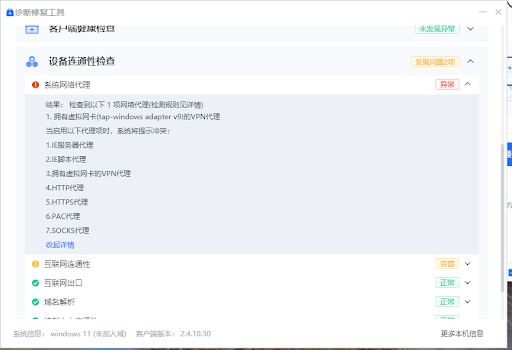

②退出梯子后显示
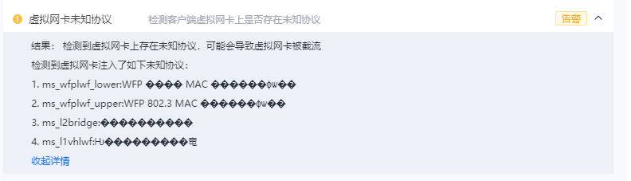
解决方案：按 Win + R 打开运行窗口，输入 ncpa.cpl 并回车，打开“网络连接”面板。在里面找到atrust创建的虚拟网卡，右键属性，在中间的“此连接使用下列项目”列表中，你会看到很多打勾的选项。
保留：
Internet 协议版本 4 (TCP/IPv4)
Internet 协议版本 6 (TCP/IPv6)
Microsoft 网络客户端
Microsoft 网络的文件和打印机共享
取消勾选：
Microsoft LLDP 协议驱动程序
链路层拓扑发现响应程序
链路层拓扑发现映射器 I/O 驱动程序
然后点击确定，再退出火绒，就可以登陆服务器了，
2、检查环境
查看项目文件夹内容
ls -lh ~/llama-project
查看有哪些Python环境可以用
source ~/miniconda3/bin/activate && conda env list
查看8张显卡的状态
nvidia-smi
输出
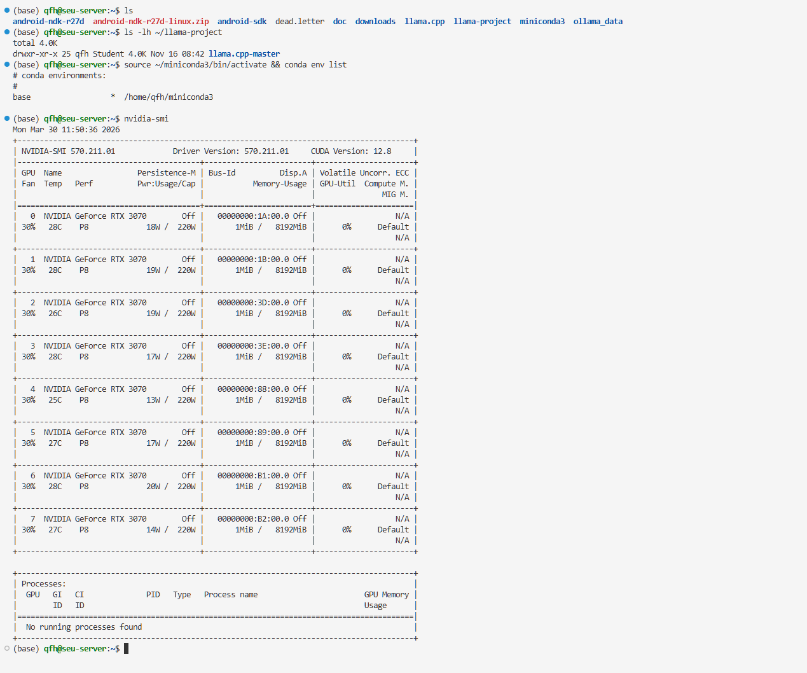
3、建立新的Python环境
（1）安装所需环境
conda create -n llmtest1 python=3.10 -y
conda activate llm_roofline
安装pytorch和transformer
pip install torch torchvision torchaudio --index-url https://download.pytorch.org/whl/cu121
pip install transformers accelerate nvitop
下载模型时报错OSError: Can't load the configuration
原因：服务器连不上 Hugging Face 的官方网站，模型权重下载失败了。 由于国内的网络环境，直接从服务器连接 Hugging Face 通常会超时或被阻断。我们之前预料到了这种情况，现在立刻换用国内的镜像源来解决。
声明镜像地址
export HF_ENDPOINT=https://hf-mirror.com
重新运行脚本
python profile_llm.py
4、写程序
编写了个ncn探针程序，但是没有root就没有安装ncn的权限，换用pytorch自带的torch.profiler
用 nano profile_llm.py 打开你的脚本，并写入代码：
import torch
from transformers import AutoModelForCausalLM, AutoTokenizer
from torch.profiler import profile, record_function, ProfilerActivity

model_id = "Qwen/Qwen1.5-0.5B"
print(f"Loading {model_id}...")
tokenizer = AutoTokenizer.from_pretrained(model_id, trust_remote_code=True)
# 明确指定放在第 0 张卡上
model = AutoModelForCausalLM.from_pretrained(model_id, device_map="cuda:0", trust_remote_code=True, torch_dtype=torch.float16)

prompt = "Explain the roofline model in computer architecture:"
inputs = tokenizer(prompt, return_tensors="pt").to(model.device)

print("Warming up GPU...")
# 先空跑一次预热 GPU，让显存分配完毕，测出来的时间才准
with torch.no_grad():
    model(**inputs)

print("Starting PyTorch Profiler...")
# 启动 PyTorch 探针！开启 flops 计算和 shape 记录
with profile(
    activities=[ProfilerActivity.CPU, ProfilerActivity.CUDA],
    record_shapes=True,
    with_flops=True  # 核心参数：让 PyTorch 帮我们算 FLOPs
) as prof:

    # --- 1. 抓取 Prefill 阶段 ---
    with record_function("Stage_Prefill"):
        with torch.no_grad():
            outputs = model(**inputs)

    past_key_values = outputs.past_key_values
    next_token = torch.argmax(outputs.logits[0, -1, :]).unsqueeze(0).unsqueeze(0)

    # --- 2. 抓取 Decode 阶段 ---
    with record_function("Stage_Decode"):
        with torch.no_grad():
            # 生成 5 个 Token 测一下平均水平
            for _ in range(5):
                out = model(input_ids=next_token, past_key_values=past_key_values, use_cache=True)
                past_key_values = out.past_key_values
                next_token = torch.argmax(out.logits[0, -1, :]).unsqueeze(0).unsqueeze(0)

# 打印出最耗时的前 15 个算子
print("\n=== Profiling Results ===")
print(prof.key_averages().table(sort_by="cuda_time_total", row_limit=15))

# 导出一个可视化的 json 文件，我们可以拖到浏览器里看时间线
prof.export_chrome_trace("llm_trace.json")
print("\nTrace saved to llm_trace.json")
按ctrl+O在nano中保存，然后按Ctrl+x退出
退出之后
python profile_llm.py
运行程序
小tips：如果原文件修改的的多，直接rm 文件名删除，然后再nano一个文件，再写入会更快
运行之后输出
5、实验结果
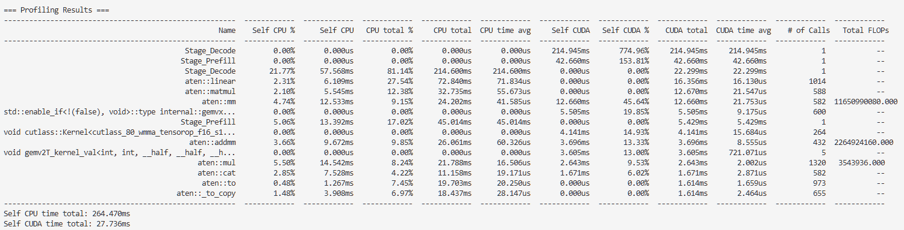
实验结果分析：
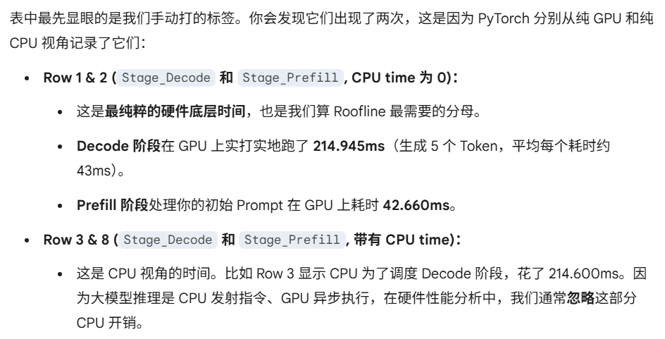
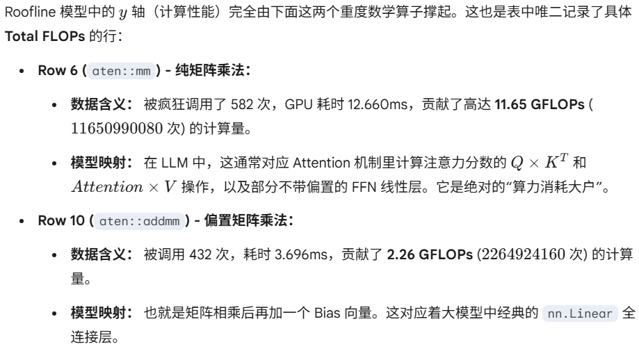
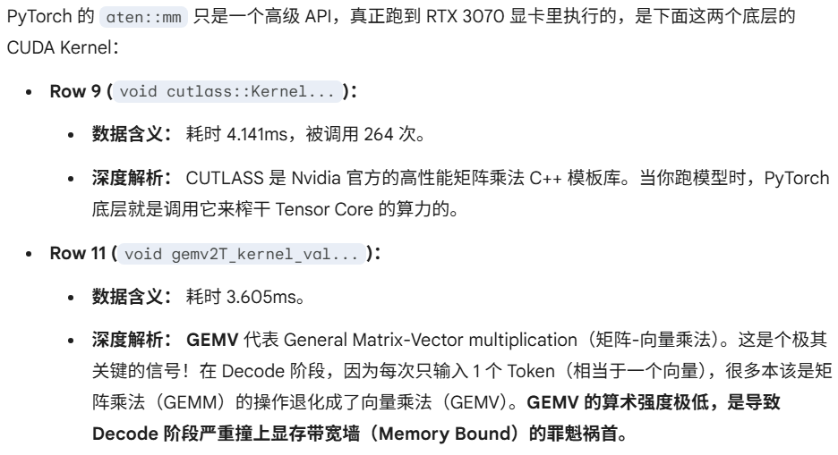
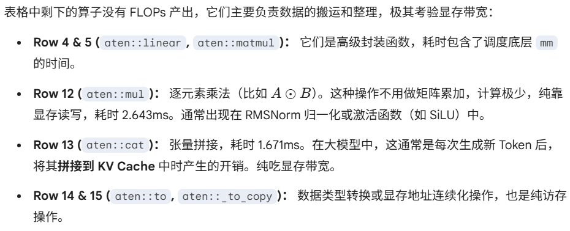
6、roofline图像
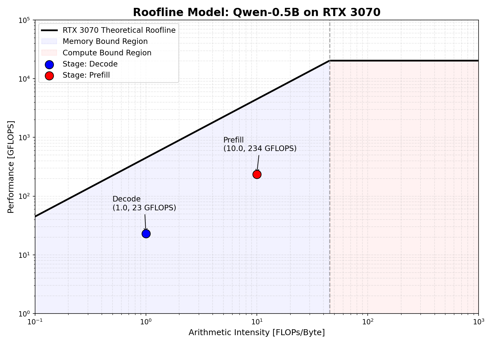
为什么画出的图像图线不是从原点开始的？
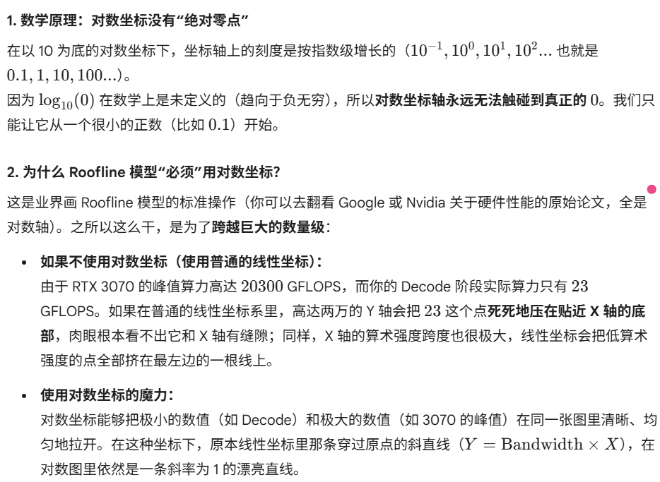
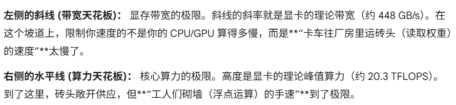
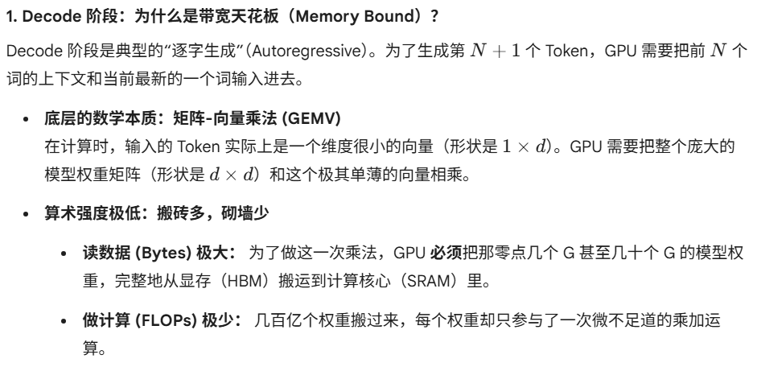
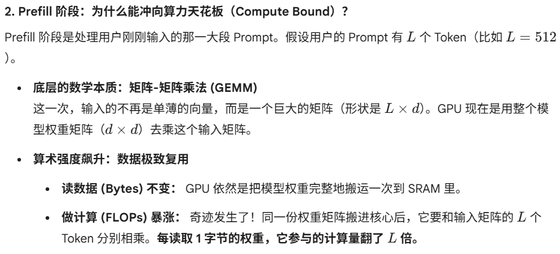
结论： 随着输入序列长度L或 Batch Size 的增加，算术强度 I 会直线上升（比如从刚才测试的 $I=10$ 飙升到上百）。点位在 Roofline 图上疯狂向右移动，跨过拐点，最终卡车运砖的速度不再是瓶颈，而是工人们的手速达到了极限——这就是算力天花板。
